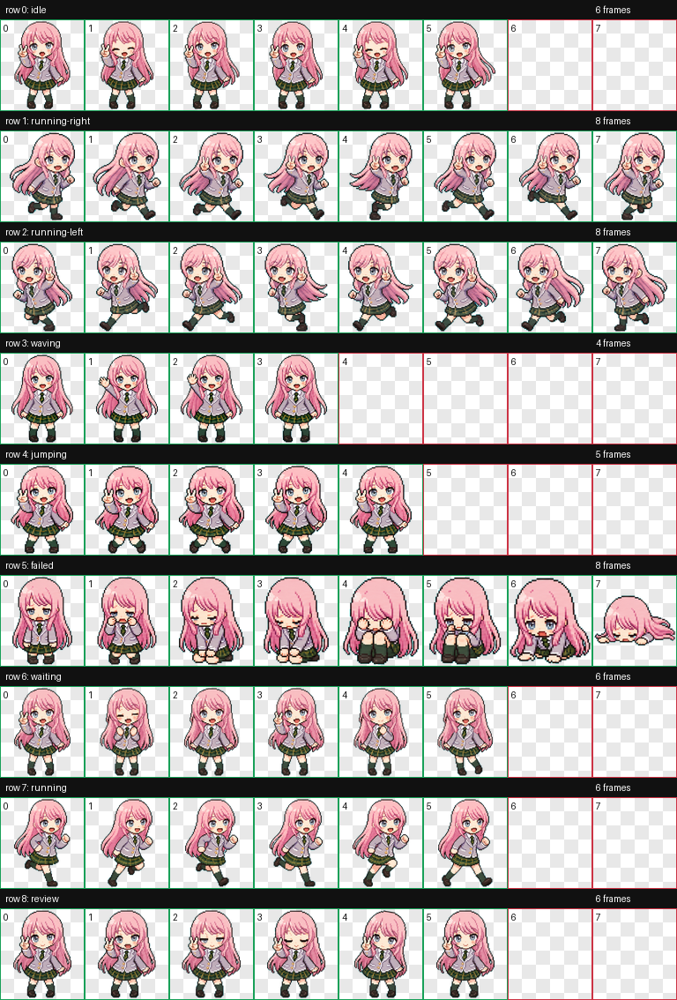

# Ano Codex Pet

An unofficial, fan-made Codex desktop pet package based on MyGO!!!!!'s Anon Chihaya.

This repository contains only the finished Codex pet files:

- `pet.json`
- `spritesheet.webp`
- `preview/contact-sheet.png`

No original reference screenshots or source images are included.

## Preview



## Install

Copy the pet files into your Codex pets directory:

```bash
mkdir -p ~/.codex/pets/anon
cp pet.json spritesheet.webp ~/.codex/pets/anon/
```

Restart Codex after installing so the app can scan the new pet.

## Pet Details

- ID: `anon`
- Display name: `Ano酱`
- Sprite atlas: `1536x1872`
- Cell size: `192x208`
- Format: WebP with alpha

Animations included:

- idle
- running-right
- running-left
- waving
- jumping
- failed
- waiting
- running
- review

## Disclaimer

This is an unofficial fan-made pet package for personal Codex customization.

It is not affiliated with, endorsed by, sponsored by, or approved by Bushiroad, MyGO!!!!!, BanG Dream!, or any related rights holder. Character inspiration and any related intellectual property belong to their respective owners.

Please do not present this repository as an official asset, official merchandise, or an authorized character release.

## License

See [LICENSE](LICENSE). This package is shared for personal, non-commercial use only.
